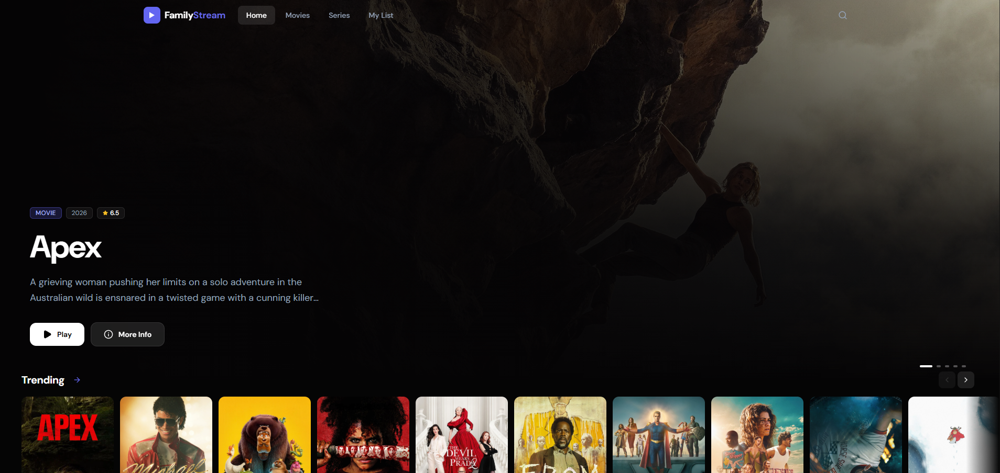

# FamilyStream 🍿

A premium, private streaming platform built as a lightning-fast React frontend. FamilyStream provides an elegant, Netflix-like interface to browse, search, and stream your favorite movies and TV series using TMDB for metadata and an embedded video player for playback.

 

## ✨ Features

- **100% Client-Side:** No database or backend required! Everything runs directly in your browser.
- **Premium UI/UX:** A stunning, dark-mode focused design built with TailwindCSS v4 and Lucide React.
- **Extensive Library:** Powered by the TMDB API, offering trending, popular, and top-rated movies and series.
- **Smart Search:** Real-time multi-search (movies, series, actors) with a responsive, animated dropdown and a dedicated advanced search page.
- **Embedded Player:** Seamless video playback directly within the app, featuring a "Cinema Mode" for immersive viewing.
- **Watch Trailers:** Directly watch official YouTube trailers from the movie/series detail modal.
- **Favorites & History:** Keep track of your favorite titles and your watch history. Everything is securely stored locally in your browser's `localStorage`.

## 🛠 Tech Stack

- **React 18** (Vite)
- **TailwindCSS v4** for styling
- **React Router v6** for navigation
- **Zustand** for lightweight state management and persistence (`localStorage`)
- **Lucide React** for beautiful icons

## 🚀 Getting Started Locally

### Prerequisites
- Node.js (v18+)
- A [TMDB API Key](https://www.themoviedb.org/settings/api)

### Setup

1. Navigate to the `frontend` directory:
```bash
cd frontend
```

2. Create a `.env` file and add your TMDB API Key:
```env
VITE_TMDB_API_KEY=your_tmdb_api_key_here
```

3. Install dependencies and start the dev server:
```bash
npm install
npm run dev
```

The application will be accessible at `http://localhost:5173`.

## ☁️ Deployment (Vercel)

Since FamilyStream is a 100% static React application, deploying it is incredibly simple. We recommend using [Vercel](https://vercel.com).

### Option 1: Via GitHub (Recommended)
1. Push this repository to your GitHub account.
2. Go to Vercel and click **Add New Project**.
3. Import your GitHub repository.
4. **Important**: Set the Framework Preset to `Vite` and the Root Directory to `frontend` (if you didn't move the files to the root).
5. In the **Environment Variables** section, add:
   - `VITE_TMDB_API_KEY` = `your_tmdb_api_key_here`
6. Click **Deploy**!

### Option 2: Docker Compose (Self-Hosted)
For those who prefer to host it on their own home server (e.g., Raspberry Pi, NAS, VPS), a highly optimized Docker configuration is provided.

1. Ensure you have Docker and Docker Compose installed.
2. Open the `docker-compose.yml` file and replace `replace_this_with_your_api_key` with your actual TMDB API Key.
3. At the root of the project, run:
```bash
docker compose up -d
```
4. The app will be available at `http://localhost:8080`.

**How it works:** The `Dockerfile` builds the React app into a static bundle and uses Nginx to serve it. To allow you to pass the `TMDB_API_KEY` without rebuilding the image, a custom entrypoint script injects your key into the static files each time the container starts.

### Option 3: Vercel CLI
```bash
cd frontend
npm i -g vercel
vercel
```
Follow the prompts, and don't forget to add your Environment Variable in the Vercel dashboard!

## ⚠️ Notes on Video Playback
The streaming functionality utilizes a third-party embedded player.
- **Ad-Blockers:** Some ad-blockers or privacy extensions (like uBlock Origin or AdGuard) may block the player's verification requests. If a video fails to load or the player crashes, **you must disable your ad-blocker specifically for the player domain**.
- **Availability:** As this relies on external sources, the availability of specific episodes or movies cannot be guaranteed.

## 📄 License
This project is intended for personal and educational use. Please ensure you comply with the terms of service of TMDB and any third-party video providers.